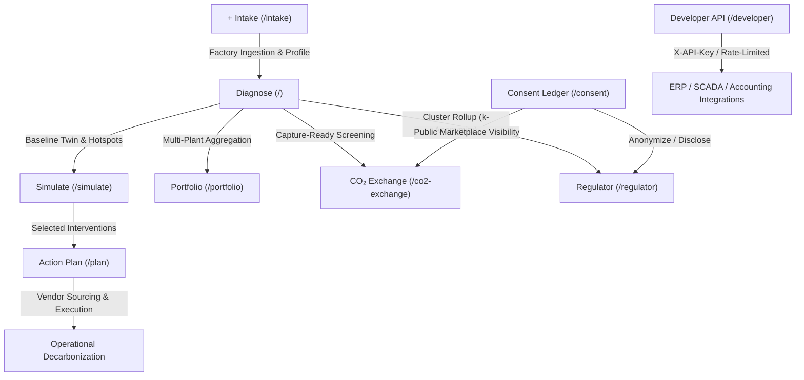

# Induscope Platform Features & Architecture Reference Guide

> **Platform Overview**: Induscope is an end-to-end industrial decarbonization, digital twin, and circular economy intelligence platform built for Gujarat's key manufacturing clusters (Morbi Ceramics, Surat Textiles, Vapi & Ankleshwar Chemicals, Ahmedabad Engineering).

---

## 1. System Architecture & Feature Lifecycle

The platform interconnects single-plant diagnostics, predictive simulation, phased execution roadmaps, multi-tenant fleet consulting, regional environmental board oversight, circular carbon marketplaces, and enterprise ERP integration.

---

## 2. In-Depth Module Specifications

### 2.1. Diagnose (`/`)
* **Primary Personas:** SME Factory Owners, Plant Engineers, Energy Auditors
* **Key Source Files:**
  * UI View: `src/pages/FactoryPage.tsx`
  * 3D Twin: `src/components/twin/FactoryTwin.tsx`
  * Hotspot Ranking: `src/components/dashboard/HotspotPanel.tsx`
  * Root Cause Engine: `backend/app/intelligence/rootcause.py`

#### Core Capabilities
1. **Scope 1 & Scope 2 Accounting:** Calculates emissions ($t\text{CO}_2\text{e/year}$) across all equipment nodes based on fuel and power inputs (Natural Gas, Grid Electricity, Lignite, Coal, Furnace Oil).
2. **Sub-Sector Benchmark Comparison:** Evaluates specific energy intensity (e.g., $\text{SCM/t}$ ceramic tile, $\text{kWh/kg}$ fabric, $\text{GJ/t}$ chemical intermediate) against real Gujarat cluster baselines.
3. **Interactive 3D Digital Twin:** Custom WebGL/Canvas schematic visualizing furnaces, kilns, boilers, dryers, compressors, and effluent treatment systems. Thermal plume colors and chimney smoke opacity adjust dynamically according to live emission metrics.
4. **R1–R6 Root-Cause Decision Tree:**
   * **R6 (Anomaly Step Change):** Triggered when monthly $z$-scores indicate a statistically significant deviation.
   * **R2 (Fuel Skew):** Triggered when high-emission factor fuels (coal, pet-coke, furnace oil) exceed $50\%$ of thermal mix.
   * **R3 (Thermal Inefficiency):** Triggered when equipment intensity exceeds benchmark by $\ge 15\%$.
   * **R5 (Fouling Drift):** Triggered when regression slope shows intensity deteriorating $>5\%/\text{year}$.
   * **R4 (Material/Waste Leakage):** Triggered on unrecovered waste or high-COD effluent streams.
   * **R1 (Low Capacity Overhead):** Fixed thermal overhead distributed over low production throughput.

---

### 2.2. Simulate (`/simulate`) [Pro]
* **Primary Personas:** Sustainability Consultants, Operations Directors
* **Key Source Files:**
  * UI View: `src/pages/SimulatorPage.tsx`
  * Intervention Picker: `src/components/simulator/InterventionPicker.tsx`
  * Impact Dashboard: `src/components/simulator/ImpactPanel.tsx`
  * Simulation Math: `backend/app/intelligence/simulator.py`

#### Core Capabilities
1. **Interactive Intervention Selection:** Enables plant operators to evaluate circular and technological upgrades:
   * Waste Heat Recovery (WHR) to spray dryers or organic Rankine cycles
   * Variable Frequency Drives (VFD) on high-pressure air compressors
   * Air-to-fuel ratio optimization with automated $\text{O}_2$ trim
   * Closed-loop glaze/slip water recycling
   * Agro-biomass pellet fuel substitution
2. **Sequential-Residual Rule:** Avoids unrealistic additive reductions. When multiple interventions affect the same equipment node:
   $$\text{Residual Emission} = E_{\text{baseline}} \times \prod_{i=1}^{k} \left(1 - \eta_i\right)$$
3. **Live Digital Twin Reaction:** 3D twin dynamically demonstrates the impact—chimney emissions diminish, equipment temperatures normalize, and the plant envelope changes state.
4. **Financial & Payback Modeling:** Outputs total CAPEX (₹ INR), annual cost savings (₹ INR/yr), combined payback time (months), and composite confidence scoring.

---

### 2.3. Action Plan (`/plan`)
* **Primary Personas:** Plant Heads, CFOs, EHS (Environment, Health & Safety) Officers
* **Key Source Files:**
  * UI View: `src/pages/ActionPlanPage.tsx`
  * Plan Logic: `src/lib/actionplan.ts`

#### Core Capabilities
1. **Phased Milestone Horizons:**
   * **30-Day Window (Quick Operational Wins):** Payback $\le 6$ months or CAPEX $< ₹500,000$ (e.g., combustion tuning, compressed air leak elimination, steam trap servicing).
   * **90-Day Window (Medium Investments):** Payback $\le 18$ months (e.g., economizers, waste heat pre-heaters, telemetry sensors).
   * **365-Day Window (Capital Projects):** Payback $> 18$ months (e.g., kiln electrification, industrial heat pumps, major fuel conversion).
2. **Return-on-Carbon Ranking:**
   $$\text{Carbon Return} = \frac{\text{tCO}_2\text{e Avoided}}{₹\text{ Lakh CAPEX}}$$
3. **Responsibility & Prerequisite Assignment:** Designates accountable operational owners (Production Head, Plant Engineer, Purchase Officer, EHS Officer) and specifies compliance prerequisites (e.g., GPCB consent amendment, baseline flue-gas audit).
4. **Integrated Vendor Sourcing:** Dynamic lookup for vetted Gujarat regional vendors by intervention category (Morbi, Ankleshwar, Ahmedabad, Surat, Vadodara).

---

### 2.4. Regulator (`/regulator`)
* **Primary Personas:** GPCB (Gujarat Pollution Control Board), Bureau of Energy Efficiency (BEE), Industrial Estate Authorities
* **Key Source Files:**
  * UI View: `src/pages/RegulatorPage.tsx`
  * Map Component: `src/components/map/ClusterMap.tsx`
  * Rollup Logic: `src/lib/rollup.ts`

#### Core Capabilities
1. **Cluster-Level Geographic Aggregation:** Displays macro footprints across Gujarat's industrial centers.
2. **Bubble Visualization Rules:**
   * **Bubble Diameter:** Total avoidable $\text{CO}_2\text{e}$ in the cluster (quantifying where technological intervention yields highest return).
   * **Color Code:** Average deviation from sub-sector clean benchmark:
     * Green: $< 10\%$ above benchmark
     * Amber: $10\%\text{--}25\%$ above benchmark
     * Red: $> 25\%$ above benchmark
3. **Small-Cell Privacy Guard (`MIN_CELL = 3`):** Industrial cells with fewer than 3 reporting facilities are automatically suppressed to ensure commercial privacy and prevent reverse-engineering of trade secrets.
4. **Symbiosis Links:** Visualizes potential cross-facility material and heat exchange pipelines between complementary industrial sectors.

---

### 2.5. Portfolio (`/portfolio`)
* **Primary Personas:** Multi-facility Consultants, Corporate ESG Auditors, Conglomerate Operations Teams
* **Key Source Files:**
  * UI View: `src/pages/PortfolioPage.tsx`
  * API Client: `src/lib/api.ts`

#### Core Capabilities
1. **Multi-Tenant Fleet Cockpit:** Consolidates multiple client facilities across sectors and regions into a unified view.
2. **Sorting & Filtering Matrix:** Filter by industrial cluster and sort by total emissions, percentage benchmark deviation, critical hotspot count, or total avoidable emissions.
3. **CCTS Carbon Credit Monetization:** Evaluates annual carbon revenue potential based on India's Carbon Credit Trading Scheme (CCTS) benchmark ($₹900/\text{t avoided CO}_2$).
4. **Multi-Tenant Organization Management:** Create organizations, map industrial units to client accounts, and seamlessly drill down into individual plant twins.

---

### 2.6. $\text{CO}_2$ Exchange (`/co2-exchange` & `/deal/...`) [Pro]
* **Primary Personas:** CCUS Project Leads, Offtake Buyers, Industrial Plant Managers
* **Key Source Files:**
  * UI View: `src/pages/Co2ExchangePage.tsx`
  * Deal View: `src/pages/Co2DealPage.tsx`
  * Match Engine: `src/lib/co2exchange.ts`

#### Core Capabilities
1. **Capture-Ready Screening:** Identifies suppliers generating capture-grade flue gases ($\ge 500\text{ t/year}$ available surplus from kilns, boilers, furnaces).
2. **Offtake Demand Modeling:**
   * *Building Materials & Concrete:* Mineral curing & carbonated aggregates ($8\%$ of monthly production capacity).
   * *Chemical Synthesis:* Chemical intermediate feedstock & neutralization ($9\%$ of emissions).
   * *Ceramics & Foundries:* Kiln atmosphere conditioning and foundry sand core hardening.
3. **Geospatial Route Optimization:** Uses the Haversine formula to constrain matches to a commercially viable **$\le 90\text{ km}$ transit radius**:
   $$d = 2R \arcsin \left(\sqrt{\sin^2\left(\frac{\Delta \phi}{2}\right) + \cos \phi_1 \cos \phi_2 \sin^2\left(\frac{\Delta \lambda}{2}\right)}\right)$$
4. **Deal Logistics & Financial Terms:** Models tanker payload ($14\text{ t/run}$), annual round trips, and delivered feedstock pricing ($₹1,450/\text{t delivered CO}_2$).
5. **Technical Feasibility Checklist:** Flue-gas composition/purity validation, capture suitability, pressurized cylinder transport, and GPCB site safety clearances.

---

### 2.7. + Intake (`/intake`)
* **Primary Personas:** Plant Operators, Data Ingestion Technicians
* **Key Source Files:**
  * UI View: `src/pages/IntakePage.tsx`
  * Data Engine: `src/lib/engine.ts`
  * Onboarding Router: `backend/app/routers/onboarding.py`

#### Core Capabilities
1. **Dual Ingestion Paths:**
   * **Guided Form:** Step-by-step entry of plant sector, monthly output, solid/liquid waste, and equipment energy metrics.
   * **CSV Bill Ingestion:** Upload bulk energy utility records (SCM gas, kWh electricity, MT coal). Includes schema checks and automatic unit conversions.
2. **Live Pre-Flight Twin Verification:** Generates a real-time reactive model preview before database commit, catching calculation errors or invalid energy ratios early.
3. **3D Spatial Layout Customizer:** Define custom coordinate positions ($X, Y, Z$) for individual equipment to match actual shop-floor arrangements.

---

### 2.8. Consent (`/consent`)
* **Primary Personas:** Compliance Officers, Legal Counsel, Audit Partners
* **Key Source Files:**
  * UI View: `src/pages/ConsentLedgerPage.tsx`
  * Business Router: `backend/app/routers/business.py`

#### Core Capabilities
1. **Consent State Enforcement:** Centralized control over `consent_to_share` status across all participating factories.
2. **Dynamic Privacy Filtering:**
   * **Opted In:** Verified commercial name and production details are shared with regulatory bodies and verified circular economy exchange partners.
   * **Opted Out:** Facility details are instantly anonymized across maps, rollups, and marketplace screens, displaying as *"Anonymous Unit"*.
3. **Immutable Audit Trail:** Direct backend writes (`PATCH /api/factories/{id}/consent`) that record an audited `consent_updated_at` timestamp for enterprise data governance.

---

### 2.9. API (`/developer`)
* **Primary Personas:** Software Engineers, Enterprise IT / ERP Integrators
* **Key Source Files:**
  * UI View: `src/pages/DeveloperApiPage.tsx`
  * Public Endpoint: `backend/app/routers/business.py`

#### Core Capabilities
1. **Cryptographic Key Minting:** Generates organization-scoped API keys with secure prefixing (`isk_...`).
2. **Rate Limiting:** Sliding-window rate limiter protecting backend infrastructure.
3. **ERP & Accounting Integration:**
   * Endpoint: `GET /api/public/v1/factories/{factory_id}`
   * Authenticated via header: `X-API-Key: isk_...`
   * Delivers validated Scope 1/2 emissions, worst equipment severity, and benchmark status directly into systems like SAP, Tally, or Oracle ERP.

---

## 3. Persona & Feature Interaction Matrix

| Feature | SME Factory Owner | Sustainability Consultant | GPCB / Environmental Regulator | IT / ERP Developer |
| :--- | :---: | :---: | :---: | :---: |
| **Diagnose** | Primary (Daily Monitor) | Secondary (Audit Tool) | Read-Only (Single Unit) | Data Consumer |
| **Simulate** | Planning Tool | Primary (Scenario Modeling)| Policy Testing | — |
| **Action plan** | Execution & Sourcing | Proposal Generation | Compliance Roadmap | ERP Task Sync |
| **Regulator** | Aggregate View | Market Analysis | Primary (Cluster Oversight)| — |
| **Portfolio** | Single Unit View | Primary (Fleet Management) | Regional Cohort View | Multi-Unit Data Sync |
| **$\text{CO}_2$ Exchange**| Supplier / Buyer | Deal Brokerage | Byproduct Transport Audit | Logistics Booking |
| **+ Intake** | Direct Data Entry | Client Onboarding | — | Batch Pipeline Sync |
| **Consent** | Privacy Control | Data Agreement Review | Data Legality Audit | Auth Header Config |
| **API** | — | — | — | Primary (System Bridge) |
