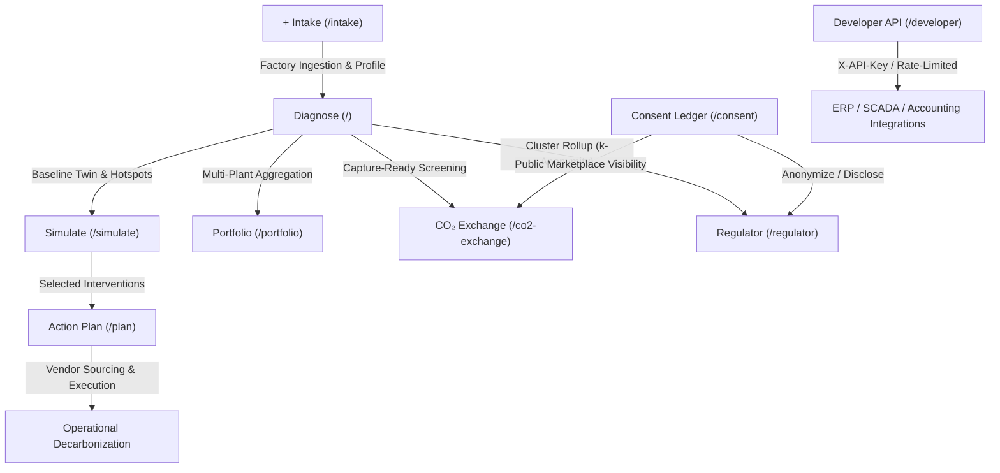

# Induscope — Circular Carbon Intelligence Platform
### Gujarat Industrial Decarbonization & Digital Twin Ecosystem

[](https://react.dev/)
[](https://threejs.org/)
[](https://fastapi.tiangolo.com/)
[](https://lightgbm.readthedocs.io/)
[](https://github.com/facebookresearch/faiss)
[](https://tailwindcss.com/)
[](https://python.org)

> **Built for HackOut'26** — *Circular Carbon Ecosystem*
> 
> **Induscope** is an end-to-end industrial decarbonization, digital twin, and circular economy intelligence platform purpose-built for Gujarat's key SME manufacturing corridors (Morbi Ceramics, Surat Textiles, Vapi & Ankleshwar Chemicals, Rajkot & Jamnagar Engineering).

---

## 📌 The Industrial Challenge

Gujarat's manufacturing clusters produce a massive share of India's ceramics, synthetic textiles, dyes, active pharmaceutical ingredients (APIs), and castings. However, thousands of operational Micro, Small, and Medium Enterprises (MSMEs) face severe constraints:
1. **Zero Process-Level Emissions Visibility:** Plants lack sub-metering; energy and fuel bills are lumped into generic overhead without equipment attribution.
2. **Sub-Sector Benchmark Ambiguity:** Operators cannot see if their specific energy consumption ($\text{SCM/t}$ tile, $\text{kWh/kg}$ fabric, $\text{GJ/t}$ chemical) deviates from regional best practices.
3. **Double-Counting Pitfalls:** Interventions are often sized additively rather than through sequential-residual physics, leading to inflated ROI promises.
4. **Disconnected Byproduct Streams:** Waste heat, ETP sludge, spent solvents, and flue gases are dumped or treated at high costs rather than matched to nearby industrial offtakers within economic transport radii.
5. **Regulatory Blindspots:** Environmental boards (GPCB) and energy agencies lack cluster-level, evidence-backed rollups to target technology subsidies effectively.

---

## 🚀 The Induscope Solution

Induscope bridges raw utility data to audit-ready decarbonization roadmaps and circular marketplaces across 9 integrated platform modules:

```
[ + Intake ] ───▶ [ Diagnose ] ───▶ [ Simulate ] ───▶ [ Action Plan ]
     │                   │
     ▼                   ▼
[ Consent ]       [ Portfolio ] ───▶ [ Regulator ]
     │                   │
     ▼                   ▼
  [ API ]         [ CO₂ Exchange ]
```



---

## 🌟 Comprehensive Module Breakdown

### 1. 🔍 Diagnose (`/`)
* **Persona:** SME Factory Owners, Plant Engineers, Certified Energy Auditors
* **Core Capabilities:**
  * **Scope 1 & Scope 2 Accounting:** Sourced emission factors from CEA (Central Electricity Authority, Grid Baseline Database v19) and IPCC 2006 Stationary Combustion Guidelines.
  * **Interactive 3D Digital Twin:** Custom WebGL/Three.js physical model rendering process nodes (kilns, boilers, furnaces, spray dryers, compressors, ETPs). Smoke opacity and thermal heat plumes dynamically scale with real fuel combustion.
  * **R1–R6 Explainable Root-Cause Decision Tree:**
    * **R1 (Fixed Overhead):** Low utilization spreading baseline thermal overhead.
    * **R2 (Fuel Mix Skew):** High emission-factor fuels (coal, pet-coke, furnace oil) $>50\%$ of thermal mix.
    * **R3 (Thermal Inefficiency):** Specific equipment intensity $\ge 15\%$ above regional benchmark.
    * **R4 (Material/Waste Leakage):** Unrecovered sludge or high-COD effluent stream loss.
    * **R5 (Fouling Drift):** Regression trend showing specific consumption drifting upward $>5\%/\text{year}$.
    * **R6 (Step Change Anomaly):** Statistically significant departure from historical baseline ($z\text{-score} > 2.5$).
  * **Calibrated Baseline Circularity:** Sourced baseline circularity ratios ($\sim 18\%\text{--}41\%$) across ceramics, chemicals, textiles, and foundries.

### 2. ⚡ Simulate (`/simulate`) [Pro]
* **Persona:** Plant Managers, Decarbonization Consultants
* **Core Capabilities:**
  * **Interactive Interventions:** Test Waste Heat Recovery (WHR), compressor VFD retrofits, boiler oxygen-trim controls, closed-loop slip/glaze recycling, and biomass pellet co-firing.
  * **Sequential-Residual Physics Engine:** Avoids double-counting. If two $20\%$ measures affect the same process:
    $$\text{Combined Reduction} = 1 - (1 - 0.20) \times (1 - 0.20) = 36\% \quad (\ne 40\%)$$
  * **Live Twin Reaction:** Chimeny smoke thins, hot equipment cools to green, and the impact panel recomputes blended CAPEX (₹ INR), annual operational savings (₹ INR/yr), payback period (months), and net $CO_2e$ reduction.

### 3. 📋 Action Plan (`/plan`)
* **Persona:** Chief Financial Officers (CFOs), EHS Officers, Plant Heads
* **Core Capabilities:**
  * **Phased Milestone Roadmap:**
    * **30-Day Window (Quick Wins):** Payback $\le 6$ months or CAPEX $< ₹5\text{ Lakh}$ (combustion air-fuel tuning, ultrasonic leak sealing).
    * **90-Day Window (Medium Projects):** Payback $\le 18$ months (economizers, VSDs, sub-metering).
    * **365-Day Window (Capital Overhauls):** Payback $> 18$ months (kiln electrification, ORC waste-heat power generation).
  * **Return-on-Carbon Metric:**
    $$\text{Priority} = \frac{\text{tCO}_2\text{e Avoided}}{₹\text{ Lakh CAPEX}}$$
  * **Accountability & Governance:** Clear role ownership (Production Head, Plant Engineer, Purchase Officer) and regulatory prerequisites (e.g., GPCB consent amendment).
  * **Vetted Regional Vendor Directory:** Direct links to verified vendors across Gujarat industrial estates (Morbi, Ankleshwar, Ahmedabad, Surat, Vadodara).

### 4. 🏛️ Regulator Rollup (`/regulator`)
* **Persona:** Gujarat Pollution Control Board (GPCB), BEE, Industrial Development Corps
* **Core Capabilities:**
  * **Geospatial Cluster Visualization:** Map of industrial clusters across Gujarat. Bubble size represents total avoidable $CO_2e$, and color indicates deviation from clean benchmarks ($\text{Green } < 10\%$, $\text{Amber } 10\text{--}25\%$, $\text{Red } > 25\%$).
  * **$k$-Anonymity Privacy Suppression:** Enforces `MIN_CELL = 3` units per cell to prevent commercial reverse-engineering of proprietary SME production data.
  * **Scale Projection Simulator:** Interactive slider modeling statewide policy impact (e.g., scaling efficiency interventions to $N$ factories statewide).

### 5. 💼 Portfolio (`/portfolio`)
* **Persona:** ESG Consultants, Holding Companies, Industry Associations
* **Core Capabilities:**
  * **Multi-Tenant Fleet Cockpit:** Multi-factory sorting by avoidable $CO_2e$, total emissions, benchmark deviation, and critical hotspots.
  * **CCTS Carbon Credit Valuation:** Monetization estimates using indicative Indian Carbon Credit Trading Scheme (CCTS) pricing ($\approx ₹900/\text{t } CO_2e$).
  * **Client Organization Grouping:** Create and assign factories to corporate entities or consulting clients.

### 6. 🔄 $\text{CO}_2$ Exchange (`/co2-exchange` & `/deal/...`) [Pro]
* **Persona:** CCUS Project Leads, Offtake Buyers, Industrial Plant Managers
* **Core Capabilities:**
  * **Capture-Ready Supplier Screening:** Filters flue-gas sources with $\ge 500\text{ t/year}$ available surplus.
  * **Cross-Sector Demand Matching:** Sized for mineral curing in concrete blocks, chemical synthesis buffering, and foundry core hardening.
  * **Geospatial Route Optimization:** Uses the Haversine formula to constrain exchanges within an economically viable **$\le 90\text{ km}$ road transit radius**.
  * **Deal Term Sheets:** Computes delivered feedstock pricing ($\approx ₹1,450/\text{t}$), tanker runs ($14\text{ t/trip}$ payload), and a 4-point technical validation checklist.

### 7. 📥 + Intake (`/intake`)
* **Persona:** Plant Technicians, Data Entry Operators
* **Core Capabilities:**
  * **Dual Ingestion:** Interactive guided forms or bulk CSV spreadsheet upload for energy bills and utility logs.
  * **Instant Pre-Flight Twin Verification:** Generates reactive 3D preview and emissions checks before writing to the database.
  * **Coordinate Layout Builder:** Custom spatial positioning ($X, Y, Z$) for equipment on the digital shop floor.

### 8. 🛡️ Consent Ledger (`/consent`)
* **Persona:** Compliance Officers, Legal Counsel, Audit Partners
* **Core Capabilities:**
  * **Data Privacy Governance:** Granular control over `consent_to_share`.
  * **Dynamic Anonymization:** Opted-in units appear with legal entity names; opted-out units are instantly masked across public maps and regulator views as *"Anonymous Unit"*.
  * **Immutable Audit Trail:** Timestamped database writes (`consent_updated_at`) fulfilling legal and governance compliance.

### 9. 🔌 Developer API (`/developer`)
* **Persona:** Enterprise IT, ERP & Accounting Software Integrators
* **Core Capabilities:**
  * **Cryptographic Key Minting:** Scoped API keys with `isk_...` format.
  * **Sliding-Window Rate Limiting:** Built-in protection against API abuse.
  * **ERP Integration:** `GET /api/public/v1/factories/{id}` with `X-API-Key` authentication for automated carbon accounting in Tally, SAP, or Oracle.

---

## 🔬 Machine Learning & Intelligence Core (`ml/`)

Induscope integrates four purpose-built ML/analytical components with rigorous empirical validation:

1. **LightGBM Benchmark Predictor (`ml/benchmark_model.py`):**
   * Predicts specific benchmark intensity from fuel mix, cluster location, and equipment scale.
   * **Result:** Outperforms flat sub-sector benchmarks by **$+36.9\%$ MAE** for known clusters and **$+6.3\%$ MAE** for unseen clusters.
2. **MiniLM + FAISS Symbiosis Matcher (`ml/symbiosis_model.py`):**
   * Matches waste streams to accepted raw inputs using semantic vector search (`all-MiniLM-L6-v2`) combined with quantity-fit and physical Haversine proximity.
   * Generates $>140$ verified circular economy pairings across Gujarat industrial estates.
3. **Tool-Calling Explainer (`ml/explainer.py`):**
   * Integrates with Ollama (`llama3.1:8b`) with a deterministic mathematical fallback.
   * Rather than hallucinating, it executes real optimizer queries (`backend/app/intelligence/simulator.py`) to answer budget and intervention queries.
4. **Empirical Autoencoder Validation (`ml/anomaly_model.py`):**
   * A PyTorch reconstruction autoencoder was rigorously trained and evaluated against leave-one-out $z$-score rules on 120 synthetic plants.
   * **Result:** Held-out testing proved the calibrated $z$-score rule outperformed the autoencoder for this specific dataset; the neural model was transparently documented and kept as an evaluation baseline rather than deployed dishonestly.

---

## 🛠️ Technology Stack

| Layer | Technologies |
| :--- | :--- |
| **Frontend UI** | React 19, TypeScript, Vite, Tailwind CSS v4, Framer Motion, Lucide Icons |
| **3D & Visuals** | Three.js, React Three Fiber (`@react-three/fiber`), Drei, Postprocessing |
| **Mapping & GIS** | Leaflet, React-Leaflet, OpenStreetMap Tiles, Haversine Engine |
| **State & Networking** | Zustand (with local persistence), React Router v7, Server-Sent Events (SSE) |
| **Backend API** | FastAPI, Uvicorn, Python 3.11+, Pydantic v2, SQLite / PostgreSQL |
| **Database & ORM** | SQLAlchemy 2.0, Alembic (database schema migrations) |
| **Machine Learning** | LightGBM, PyTorch, Sentence-Transformers, FAISS-CPU, Pandas, NumPy, Scikit-Learn |

---

## ⚡ Quickstart Guide

### Prerequisites
* **Node.js** $\ge 18.0$ and **npm**
* **Python** $\ge 3.11$

### 1. Clone the Repository
```bash
git clone https://github.com/shreyascoder2006/gandhinagar_hackout.git
cd gandhinagar_hackout
```

### 2. Backend Setup
```bash
# Navigate to backend directory
cd backend

# (Optional) Create and activate a virtual environment
python -m venv venv
# On Windows:
.\venv\Scripts\activate
# On macOS/Linux:
source venv/bin/activate

# Install dependencies
pip install -r requirements.txt
pip install lightgbm pandas

# Apply database migrations
python -m alembic upgrade head

# Seed calibrated Gujarat dataset (120 factories across 9 clusters)
python -m app.db.seed_loader

# Start the FastAPI server
python -m uvicorn app.main:app --port 8811 --reload
```
* The backend will be live at: `http://localhost:8811`
* Interactive API Documentation (Swagger): `http://localhost:8811/docs`

### 3. Frontend Setup
In a new terminal window:
```bash
# From the project root
npm install

# Start the Vite development server
npm run dev
```
* Open your browser at: `http://localhost:5173`

---

## 📊 Sourced Emission & Benchmark Calibration

Induscope rejects arbitrary hardcoding. All numbers stem from official standards:

* **Grid Electricity:** Central Electricity Authority (CEA) $CO_2$ Baseline Database v19 ($0.716\text{ kgCO}_2/\text{kWh}$).
* **Natural Gas:** IPCC 2006 Guidelines for National Greenhouse Gas Inventories ($56,100\text{ kgCO}_2/\text{TJ}$).
* **Coal / Lignite / Pet Coke:** Sourced Indian lignite factors ($94,600\text{--}101,200\text{ kgCO}_2/\text{TJ}$).
* **Circular Pricing:**
  * Delivered captured $CO_2$ feedstock: $\approx ₹1,450/\text{tonne}$.
  * CCTS compliance carbon credit midpoint: $\approx ₹900/\text{tonne}$.

---

## 📜 Repository Structure

```
├── backend/                  # FastAPI Application
│   ├── alembic/              # Database schema migrations
│   ├── app/
│   │   ├── db/               # SQLAlchemy models & seed loader
│   │   ├── engine/           # Emissions, units & intensity math
│   │   ├── intelligence/     # Root cause (R1-R6), simulator, recommender
│   │   ├── routers/          # REST endpoints (factories, catalog, business, etc.)
│   │   └── main.py           # FastAPI entrypoint
│   └── requirements.txt      # Python dependencies
├── data-pipeline/            # Data sourcing & calibration scripts
│   ├── clean/                # Raw factors, cluster coordinates & benchmarks
│   ├── synth/                # Synthetic 120-factory generator
│   └── sources.md            # Citation documentation
├── ml/                       # Machine Learning layer
│   ├── benchmark_model.py    # LightGBM benchmark predictor
│   ├── anomaly_model.py      # PyTorch autoencoder & evaluation
│   ├── symbiosis_model.py    # MiniLM + FAISS vector matcher
│   ├── explainer.py          # Tool-calling LLM explainer
│   └── registry.py           # Process-wide ModelRegistry singleton
├── src/                      # React Frontend Application
│   ├── components/
│   │   ├── dashboard/        # KPI bars, hotspot ranking, scale impact
│   │   ├── simulator/        # Intervention picker, impact panel
│   │   ├── twin/             # Three.js 3D factory digital twin
│   │   ├── map/              # Leaflet cluster maps
│   │   └── assistant/        # Chat assistant widget
│   ├── pages/                # Factory, Simulator, Plan, Regulator, Portfolio, etc.
│   ├── store/                # Zustand state management
│   └── lib/                  # Mathematical engines & API adapters
└── validation/               # Baseline metric checks & CI validation tests
```

---

## 🏆 HackOut'26 Team

* **Project:** Induscope — Circular Carbon Intelligence
* **Theme:** Circular Carbon Ecosystem & Industrial Decarbonization
* **Target Corridors:** Morbi, Surat, Vapi, Ankleshwar, Ahmedabad, Rajkot, Jamnagar

---

## 📄 License
This project is developed under the MIT License. See [LICENSE](LICENSE) for details.
