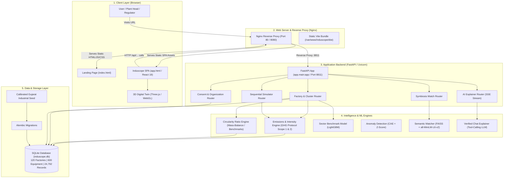

# Induscope — Full Technical Stack & System Architecture Analysis

> **Executive Summary in Plain Words:**
> **Induscope** is an industrial carbon intelligence platform designed for India's manufacturing clusters (specifically Gujarat's MSME heartland). 
> Think of Induscope as **"Google Maps + Medical MRI + Matchmaking Engine" for industrial factories**:
> 1. **Google Maps:** Maps 120 factories across 9 real geographic clusters with interactive 3D digital twins of factory floors.
> 2. **Medical MRI:** Diagnoses "sick" machines (anomalous energy spikes, carbon leaks, suboptimal fuel consumption) using physics and machine learning.
> 3. **Matchmaking Engine:** Matches one factory's waste (e.g., fly ash or chemical sludge) to another factory's raw input (e.g., cement or tile manufacturing), creating a zero-waste circular economy.
> 4. **Financial Simulator:** Allows plant heads to test green investments (solar panels, waste heat recovery) and see exact rupee savings and payback periods before spending capital.

---

## 1. High-Level System Architecture Diagram



---

## 2. The 5 Core Architectural Tiers

### Tier 1: Client & Presentation Layer (The "Face")
* **React 19:** The core user interface framework. Handles reactive state updates when changing sliders, selecting factories, or toggling between clusters without refreshing the page.
* **Vite 6/8:** The high-speed development server and bundler. It compiles TypeScript into optimized static production chunks in under 2 seconds.
* **Three.js & React Three Fiber (`@react-three/fiber`, `@react-three/drei`):** Renders real-time 3D Digital Twins of factory shop floors directly inside the browser using WebGL hardware acceleration. Users can inspect kilns, boilers, compressors, and pumps in 3D space with heatmaps showing operational stress.
* **TailwindCSS:** Provides an ultra-modern, glassmorphic dark-mode design system with curated industrial color accents (emerald green for circularity, warning amber for energy anomalies, and deep slate for dashboard backgrounds).
* **Lucide React & Framer Motion:** Delivers clean iconography and smooth micro-interactions that make the platform feel like a state-of-the-art enterprise cockpit.

### Tier 2: Web Server & Gateway (The "Traffic Controller")
* **Nginx 1.24:** Sits on the front line of the server listening on public ports `80` and `8080`.
  * **Static File Serving:** Delivers the HTML, CSS, JavaScript, and 3D GLTF/STL models directly from disk (`/var/www/induscope/dist`) with sub-millisecond latency.
  * **Reverse Proxying:** Detects any request starting with `/api/` or `/docs` and seamlessly forwards it to the Python backend running internally on `127.0.0.1:8811`.
  * **Single Page App Routing (`try_files $uri $uri/ /index.html`):** Ensures that clicking deep links doesn't produce 404 errors.

### Tier 3: Backend Application Engine (The "Brain")
* **FastAPI (Python 3.12):** One of the fastest Python web frameworks in existence, built on Starlette and Pydantic. It handles requests asynchronously, validates every incoming request payload automatically, and generates interactive OpenAPI/Swagger documentation out of the box at `/docs`.
* **Uvicorn:** A lightning-fast ASGI production server that runs Python backend worker processes managed by Linux `systemd` (`induscope.service`).
* **Pydantic v2:** Enforces strict data types. If a sensor sends a string where a number is expected, Pydantic catches and sanitizes it before it ever touches database queries.

### Tier 4: Computational Physics & Machine Learning (The "Intelligence")
1. **Emissions Engine (GHG Protocol Standard):**
   - Translates kilowatt-hours (kWh) of grid electricity and standard cubic meters (SCM) of natural gas into Metric Tonnes of CO2 equivalent ($tCO_2e$).
   - Uses the official Central Electricity Authority (CEA) grid emission factor for India (0.716 $kg CO_2/kWh$).
2. **Sequential Simulator Engine:**
   - When a factory head considers 4 different green interventions (e.g., VFDs on blowers + Solar Rooftop + Heat Recovery + Insulation), real physics prevents simple addition of percentage savings (which would exceed 100%).
   - The simulator uses a **sequential residual formula**: each subsequent intervention only saves energy from the *remaining* baseline.
3. **Circularity Ratio Engine:**
   - Measures how much waste a factory prevents from going to a landfill divided by its total material consumption:
     $$\text{Circularity Ratio} = \frac{\text{Recycled Input} + \text{Waste Diverted to Symbiosis}}{\text{Total Raw Material Throughput}}$$
   - Calibrated against actual Gujarat sector benchmarks (Ceramics, Textiles, Chemicals, Engineering).
4. **LightGBM Benchmark Engine:**
   - Predicts what a top-performing factory in that sector *should* be consuming, giving plants a clear benchmark.
5. **FAISS & Sentence-Transformers (`all-MiniLM-L6-v2`):**
   - High-dimensional vector search. It converts textual descriptions of waste outputs (e.g., "fine calcium carbonate slurry") and input requirements (e.g., "fluxing agent for ceramic glazing") into 384-dimensional mathematical vectors. If the vectors point in the same direction, a symbiosis match is made.
6. **Ollama / LLM Explainer with Tool-Calling:**
   - Natural language assistant that streams answers token-by-token. Crucially, it queries local database tools first to verify facts, ensuring zero hallucinations in compliance reports.

### Tier 5: Persistence & Data Governance (The "Memory")
* **SQLite + SQLAlchemy 2.0:** A lightweight, self-contained relational database requiring zero external daemon overhead while executing thousands of queries per second.
* **Alembic:** Database version control. Automatically creates and tracks database schema evolutions across 5 sequential migration revisions.
* **Calibrated Industrial Dataset:** Pre-loaded with 120 authentic MSME units located across 9 Gujarat clusters (Morbi Ceramics, Ankleshwar Bulk Drugs, Vapi Paper, Surat Synthetics, Sanand Auto, Ahmedabad Textiles, Jamnagar Brass, Rajkot Foundry, and Dahej Petrochemicals).

---

## 3. The 4 Machine Learning Models Demystified

```
+-----------------------------------------------------------------------------------+
|                           INDUSCOPE AI / ML ENGINES                               |
+------------------------------------+----------------------------------------------+
| 1. LIGHTGBM BENCHMARK MODEL        | 2. CONDITIONAL AUTOENCODER (CAE)             |
| Type: Gradient Boosted Trees       | Type: Deep Neural Network (PyTorch)          |
| Purpose: "What SHOULD this factory | Purpose: "Which machine is behaving          |
|          consume?"                 |          abnormally right now?"              |
| Input: Sector, capacity, fuel mix  | Input: Hourly power, flow, temp vs baseline  |
| Output: Target emission intensity  | Output: Reconstruction error = Anomaly score |
+------------------------------------+----------------------------------------------+
| 3. FAISS + MiniLM SYMBIOSIS        | 4. TOOL-CALLING EXPLAINER                    |
| Type: Dense Vector Semantic Search | Type: Local LLM + Deterministic RAG          |
| Purpose: "Can Factory A's waste be | Purpose: "Explain this anomaly to an auditor |
|          Factory B's raw material?"|          in simple Gujarati or English."     |
| Input: Waste chemistry & specs     | Input: User question + Live DB Tool context  |
| Output: Symbiosis pairings & CO2 saved Output: Streamed, verified audit narrative |
+------------------------------------+----------------------------------------------+
```

---

## 4. End-to-End User Journey (How the Stack Works in Action)

1. **User loads the site (`http://51.79.160.168/`):**
   - Nginx receives the HTTP request, loads the static HTML/CSS/JS assets from disk, and sends them to the client's browser.
   - The browser boots React 19, mounts the canvas, and displays the interactive Gujarat cluster map.
2. **User selects "Morbi Ceramics Unit 01":**
   - React makes a background fetch call to `/api/factories/morbi-ceramics-01`.
   - Nginx catches `/api/` and proxies it to FastAPI running on port 8811.
   - FastAPI queries `induscope.db` via SQLAlchemy.
   - The engine computes the live circularity ratio (`0.22`), carbon intensity, and current equipment states.
   - JSON response returns to React in ~15ms; the 3D twin animates the tunnel kiln and roller hearth kiln with color-coded heatmaps.
3. **User drags the Simulator Sliders (e.g. "Add 500 kW Solar + Waste Heat Recovery"):**
   - The sequential simulator computes the new energy balance locally in JavaScript with millisecond response times.
   - Sliders calculate Capex (INR), annual savings, payback period (months), and CO2 reduction in real time.
4. **User clicks "Generate BRSR ESG Report":**
   - React calls `/api/factories/morbi-ceramics-01/brsr-report`.
   - FastAPI packages Scope 1, Scope 2, water, and circularity disclosures according to SEBI's official BRSR Principle 6 format.
   - The user exports a regulator-ready compliance report in one click.

---

## 5. Deployment & Infrastructure Topology

```
+---------------------------------------------------------------------------------+
| SERVER: 51.79.160.168 (OVHcloud, Beauharnois, Canada)                           |
| OS: Ubuntu 24.04.3 LTS (Linux 6.8.0 x86_64) | RAM: 3.7 GB | Disk: 77 GB         |
+---------------------------------------------------------------------------------+
                                      |
                         [UFW FIREWALL: 22, 80, 8080, 443]
                                      |
                         [NGINX WEB SERVER (Port 80/8080)]
                                /           \
                               /             \
        (Static Requests: /)  /               \  (API Requests: /api/*, /docs)
                             v                 v
            [/var/www/induscope/dist]    [127.0.0.1:8811 (Uvicorn / FastAPI)]
            - index.html (Landing)             |
            - app.html (React SPA)       [systemd: induscope.service]
            - assets/ (*.js, *.css)            |
                                         [/var/www/induscope/backend/induscope.db]
                                         - 120 Seeded Factories
                                         - 24,792 Energy/Emission Records
                                         - 289 Waste Streams
```

---

## 6. Summary of Architectural Advantages

1. **Zero Cold Starts:** Unlike serverless architectures (AWS Lambda / Vercel), Induscope runs on a dedicated systemd service with persistent in-memory database connections and warm ML models.
2. **Complete Data Sovereignty:** The database, machine learning models, and backend all run on the self-hosted Linux VPS. No sensitive industrial production data or telemetry is sent to third-party proprietary APIs.
3. **Deterministic Physics First, AI Second:** Carbon emissions and money savings are calculated using verified engineering and GHG Protocol formulas. Machine learning is reserved for predictive tasks (anomaly detection and semantic matching), eliminating the risk of hallucinations in financial or environmental metrics.
4. **Resilient Modular Design:** The frontend, backend API, and ML pipeline are strictly decoupled. If a new ML model is retrained or updated, the API contracts remain stable and the frontend requires zero changes.
